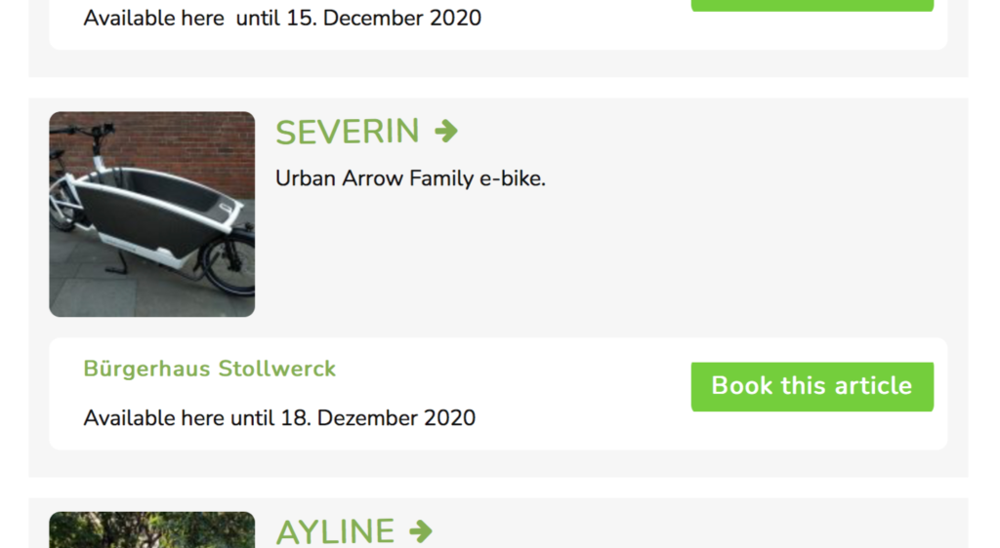

#  Merkmale & Funktionen

CommonsBooking gibt euch die Möglichkeit, Dinge (etwa: Lastenräder, Werkzeuge)
zur gemeinschaftlichen Verwendung bereit zu stellen.

CommonsBooking ist ein WordPress-Plugin und lässt sich so einfach in
bestehende Webseiten integrieren.

[ installieren ](/dokumentation/installation/installieren)

[ Dokumentation ](/dokumentation)

* * *

##  Die wichtigsten Features

###  Flexible Buchung

  * **Neu:** Mehrere Buchungen pro Tag (etwa: Stundenweise Buchung)
  * Vollständige Buchungsstrecke (Checkout) mit Buchungscodes
  * Einstellbare maximale Buchungsdauer
  * Bestätigungs-Mails an Ausleihende und Stationen
  * Kartendarstellung im Frontend mit Filtermöglichkeiten

###  Einfache Administration

  * ****Neu** : ** Benutzer*innen können zugeordnete Artikel, Stationen und Zeiträume selbst verwalten.
  * Automatische Buchungsannahme: Nutzende können Gegenstände buchen, ohne dass Administration nötig ist.

* * *

##  Screenshots

 Buchungskalender mit stundenweiser
Ausleihe   Buchungsstrecke in
CommonsBooking   Kartendarstellung
mit Verfügbarkeit   Übersichtliche
Artikelliste

* * *

##  Weiterentwicklung

CommonsBooking wird aktuell ständig weiterentwickelt. Folgende Meilensteine
sind Teil der geplanten Weiterentwicklung:

  * Erweiterte Meta-Daten
  * Implementierung der CommonsAPI

[ installieren ](/dokumentation/installation/installieren)

[ Roadmap der geplanten Weiterentwicklung ](/dokumentation/roadmap)

* * *

##  Anwendungsbereiche

Entwickelt wurde das WordPress-Plugin ursprünglich für die Bedürfnisse der [„Freies Lastenrad“-Bewegung](http://www.dein-lastenrad.de),
es kann aber für den Verleih beliebiger Dinge verwendet werden.

  * Du/deine Organisation besitzt Werkzeuge, die nicht täglich genutzt werden, und ihr möchtet sie verfügbar machen für lokale Gruppen.
  * Du besitzt eine Lastenrad und willst es mit der Gemeinschaft teilen, es soll über das Jahr hinweg an verschiedenen Standorten stationiert sein.

* * *

##  Newsletter abonnieren

Wir halten dich auf dem Laufenden. Abonniere unseren CommonsBooking Newsletter
_

Bitte dieses Feld leer lassen

###  Newsletter abonnieren für Update-Infos

Prüfe deinen Posteingang oder Spam-Ordner, um dein Abonnement zu bestätigen.

_

Bitte dieses Feld leer lassen

###  Newsletter abonnieren für Update-Infos

Prüfe deinen Posteingang oder Spam-Ordner, um dein Abonnement zu bestätigen.

